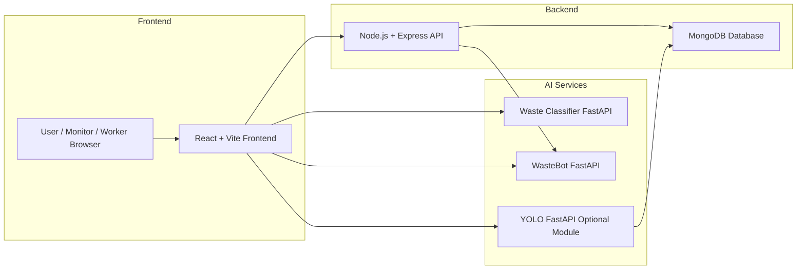
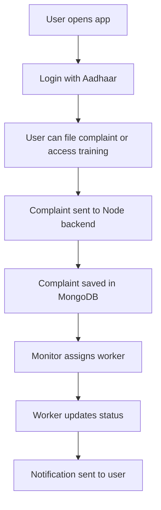
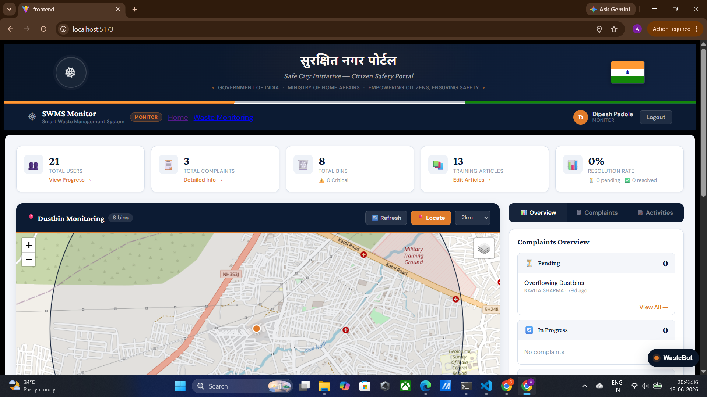
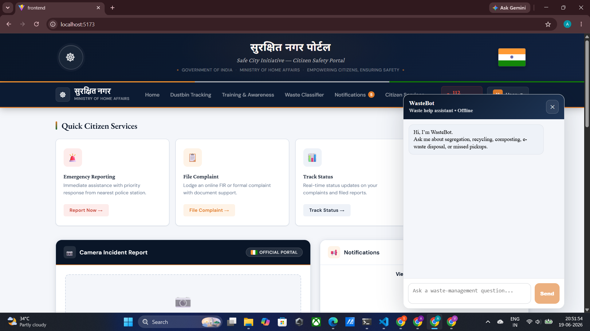
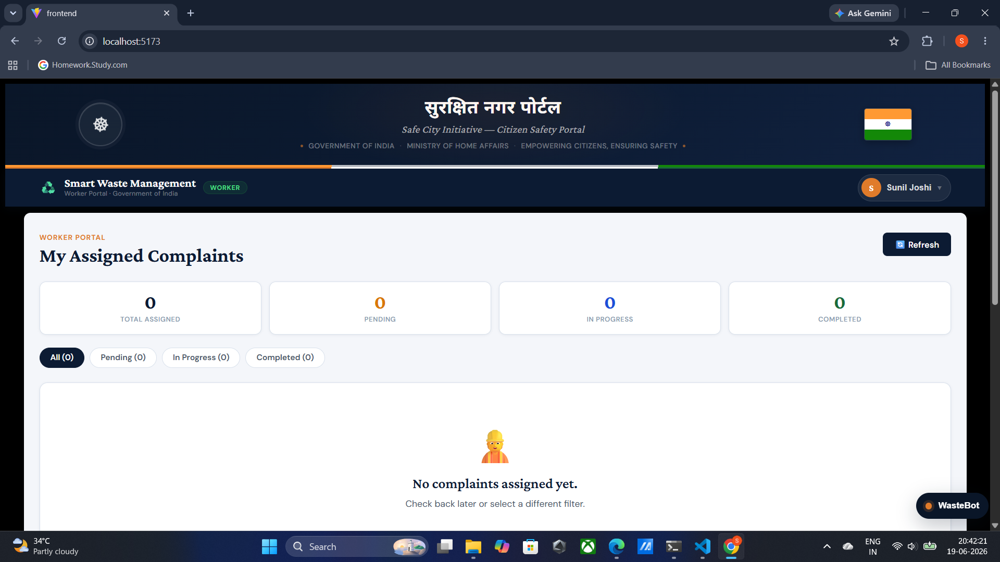
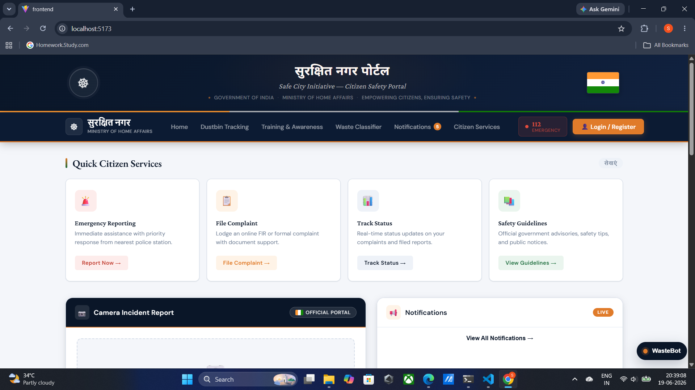

# Smart Waste Management System

[](https://react.dev/)
[](https://nodejs.org/)
[](https://www.mongodb.com/)
[](https://fastapi.tiangolo.com/)
[](https://www.python.org/)
[](https://vitejs.dev/)
[](https://opensource.org/licenses/ISC)

## 🚀 Project Overview

**Smart Waste Management System** is a full-stack portfolio project designed to modernize municipal waste handling. It integrates user complaint management, worker dispatch, admin monitoring, waste classification, and a knowledge-driven WasteBot assistant within a unified platform.

This repository brings together:
- A React + Vite multi-role frontend
- An Express + MongoDB backend API
- A Python-based waste classifier service
- A Python FastAPI WasteBot chat assistant powered by RAG and Groq
- An optional YOLO-based smart waste monitoring module for image-based detection

---

## 🎯 Problem Statement

Urban waste management often suffers from delayed grievance tracking, limited user awareness, and disconnected field operations. Municipal leaders need a system that empowers citizens, automates complaint assignment, provides proactive waste classification, and gives administrators real-time monitoring.

---

## 💡 Solution Overview

This project solves that gap by delivering a unified system where:
- citizens can register, file issues, track complaints, and access training content;
- workers can receive assignments and update complaint statuses;
- monitors can see dashboard analytics, manage complaints, and send notifications;
- AI services classify waste images and answer waste management questions through WasteBot;
- optional YOLO-based image detection supports future smart waste monitoring.

---

## ✅ Features

| Feature | Description |
|---|---|
| Multi-role web app | Separate User, Monitor, and Worker portals with role-specific navigation. |
| Complaint management | Track complaints, upload images, assign workers, update statuses. |
| User profile | Aadhaar-based profile, complaint history, awareness articles, notifications. |
| Waste classification | Image-based waste type detection via Hugging Face model. |
| WasteBot assistant | RAG-powered chatbot for waste guidance using Groq LLM. |
| Admin dashboard | Monitor user, complaint, progress statistics, and activities. |
| IoT-ready monitoring | Dustbin location dataset and optional YOLO image detection module. |
| Training content | Article CRUD backend and frontend access for user awareness. |
| File upload | Multer file storage for complaint images with safe upload handling. |
| API proxy | Backend proxies chat traffic to the WasteBot service. |

---

## 🧩 System Architecture



---

## 🔄 Working Flow



### Data flow summary
1. Frontend sends API requests via `Frontend/src/API/api_req.jsx`.
2. Backend routes in `Backend/app.js` process requests and use Mongoose models from `Backend/Models/`.
3. Complaint images are uploaded with Multer to `Backend/uploads/complaints/` and referenced in MongoDB.
4. WasteBot chat requests are proxied through `/wastebot/chat` to the Python WasteBot service.
5. Image classification requests target `http://localhost:5000/api` (or the configured waste classifier URL).
6. Optional YOLO image detection module operates under `yolo/` and can be connected via a separate frontend.

---

## 🧱 Technology Stack

### Frontend
- React 19
- Vite
- React Router DOM
- Axios
- Leaflet + React Leaflet
- Lucide-react icons
- ESLint

### Backend
- Node.js
- Express 5
- MongoDB
- Mongoose
- Multer
- CORS

### AI / ML
- WasteBot: Python, FastAPI, LangChain, Groq LLM, document retrieval, RAG
- Waste classifier: Python, FastAPI, Transformers, Hugging Face `watersplash/waste-classification`, Torch, PIL
- YOLO module: Python, FastAPI, Ultralytics YOLOv8, OpenCV, SQLite (optional)

### Databases
- MongoDB (main backend)
- SQLite (YOLO backend history)
- Local file storage for uploads and vector store cache

---

## 📁 Folder Structure

```text
.
├── Backend/                # Main Express API and MongoDB models
│   ├── app.js
│   ├── Models/
│   │   ├── user.js
│   │   ├── Filecomplaint.js
│   │   ├── Training.js
│   │   ├── UserProgress.js
│   │   ├── dustbin_location.js
│   │   ├── message.js
│   │   └── Task.js
│   ├── uploads/            # Complaint images
│   └── waste_monitoring.sqlite3
├── Frontend/              # React multi-role frontend
│   ├── src/
│   │   ├── App.jsx
│   │   ├── API/
│   │   ├── Pages/
│   │   ├── Office/
│   │   ├── Worker/
│   │   └── Componets/
│   ├── package.json
│   └── vite.config.js
├── WasteBot/              # RAG-based chatbot assistant
│   ├── api_server.py
│   ├── main.py
│   ├── pipeline.py
│   ├── rag_chain.py
│   ├── embeddings.py
│   ├── vectorstore.py
│   ├── splitter.py
│   ├── loader.py
│   ├── data/              # Source documents
│   └── vector_store/
├── wasteClassifier/       # Image classification API service
│   └── app/main.py
├── yolo/                  # Optional smart monitoring module
│   ├── backend/
│   ├── frontend/
│   └── models/
├── SImages/               # Project screenshots for README
├── STARTUP_GUIDE.md
└── WASTEBOT_SETUP.md
```

---

## 🔧 Installation Guide

### Prerequisites
- Node.js 18+
- npm
- Python 3.9+
- MongoDB running locally
- Optional: Groq API key for WasteBot
- Optional: `yolov8n.pt` or custom YOLO weights for `yolo/`

### 1. Setup Backend
```bash
cd Backend
npm install
npm start
```
- Backend runs at `http://localhost:3000`
- MongoDB connects to `mongodb://localhost:27017/waste-management`

### 2. Setup Frontend
```bash
cd Frontend
npm install
npm run dev
```
- Frontend runs at `http://localhost:5173`

### 3. Setup WasteBot
```bash
cd WasteBot
python -m venv .venv
.\.venv\Scripts\Activate.ps1
pip install -r requirements.txt
python main.py --server --warmup
```
- WasteBot runs at `http://127.0.0.1:8001`

### 4. Setup Waste Classifier
```bash
cd wasteClassifier
python -m venv .venv
.\.venv\Scripts\Activate.ps1
pip install transformers torch pillow fastapi uvicorn python-dotenv
python -m uvicorn app.main:app --host 127.0.0.1 --port 5000
```
- Classifier runs at `http://127.0.0.1:5000`

### 5. Optional: Setup YOLO Module
```bash
cd yolo/backend
python -m venv .venv
.\.venv\Scripts\Activate.ps1
pip install -r requirements.txt
python -m uvicorn app.main:app --reload
```
```bash
cd yolo/frontend
npm install
npm run dev
```
- YOLO backend default port: `8000`
- YOLO frontend default port: `5174`

---

## ▶️ Usage Instructions

### User Workflow
1. Open `http://localhost:5173`
2. Login using Aadhaar and password flow
3. File a complaint using the complaint form
4. Upload an image for issue verification
5. Track complaint status and view notifications
6. Access training articles for waste awareness
7. Use the AI WasteBot for guidance
8. Use the waste classifier page to detect recyclable and organic waste

### Monitor Workflow
1. Login as monitor
2. View aggregate statistics on the dashboard
3. Manage complaints and user progress
4. Send notifications and edit awareness content
5. Inspect worker assignment activity

### Worker Workflow
1. Login as worker
2. View assigned complaints
3. Update complaint status to `in-progress` or `completed`
4. Receive completion notifications for users

### AI Services
- WasteBot: available through the floating widget on the frontend
- Waste classifier: upload an image and get predicted waste label and recyclable guidance
- YOLO module: upload area images and get cleanliness metrics and object detection results

---

## 🖼️ Screenshots

### Admin Dashboard


*Admin analytics and complaint overview.*

.png)
*Monitor complaint assignments and user activity.*

.png)
*Real-time waste monitoring and dashboard metrics.*

.png)
*Admin actions for complaint workflow and staff tracking.*

.png)
*Notification and communication panel for administrators.*

### User Portal


*User home page with accessible services and training links.*

.png)
*File waste complaints with description and image upload.*

.png)
*Track complaint progress and worker assignment details.*

.png)
*Personal profile and Aadhaar-based user information.*

.png)
*In-app notifications for complaint resolution and awareness.*

.png)
*WasteBot assistant integrated into the user dashboard.*

### Worker Portal


*Worker dashboard showing assigned task list.*

.png)
*Manage issue status and update progress on assignments.*

.png)
*Worker view with complaint details and completion controls.*

### Landing and Home Screens


*Main landing page for Smart Waste Management System.*

---

## 📌 Major Modules Explained

### `Backend/app.js`
The main server file that:
- connects to MongoDB,
- configures CORS,
- serves complaint images from `Backend/uploads`,
- handles user, complaint, article, worker, message, and progress endpoints,
- proxies WasteBot chat and health requests to the Python WasteBot service.

### `Backend/Models/`
- `user.js` — user schema with roles: `user`, `monitor`, `worker`
- `Filecomplaint.js` — complaint schema, image metadata, status, worker assignment
- `Training.js` — training article schema for awareness content
- `UserProgress.js` — learning progress tracking
- `dustbin_location.js` — dustbin location dataset for map view and monitoring
- `message.js` — internal messaging/notification storage
- `Task.js` — complaint task metadata for dispatch logic

### `Frontend/src/App.jsx`
Routes all user, monitor, and worker pages using React Router. It loads the correct header and footer for the current role, mounts the `WasteBotWidget`, and protects routes by role.

### `Frontend/src/API/api_req.jsx`
Axios client for backend API requests, configured to respect `VITE_NODE_API_BASE_URL` or `VITE_API_BASE_URL`.

### `Frontend/src/API/waste_classifier_api.jsx`
Wrapper for the image classification backend, using `VITE_WASTE_CLASSIFIER_API_BASE_URL`.

### `Frontend/src/API/wastebot_api.jsx`
Wrapper for WasteBot conversation requests using `VITE_WASTEBOT_API_BASE_URL`.

### `WasteBot/api_server.py`
FastAPI wrapper that exposes `/health` and `/chat` for the RAG chatbot. It initializes a retrieval pipeline, loads documents from `WasteBot/data/`, and forwards queries to the Groq-powered model.

### `WasteBot/pipeline.py` and `WasteBot/rag_chain.py`
These files create and query the RAG pipeline, build embeddings, and enable semantic search over waste management documents.

### `wasteClassifier/app/main.py`
FastAPI image classification service that loads the Hugging Face waste classification model and returns top-K predictions, confidence, and recyclable mapping.

### `yolo/`
Optional smart monitoring module for image-based area detection with YOLOv8. It includes a dedicated FastAPI backend and React/Tailwind frontend for admin monitoring.

---

## 🛠️ How Files Interact

- Frontend pages call the backend through `API` wrappers.
- Backend uses Mongoose models to persist data and run business logic.
- Complaint image uploads are saved on disk and referenced in MongoDB.
- WasteBot chat calls are proxied by backend to the Python service, allowing the frontend to use a single host.
- The waste classifier service is a standalone API for image-based classification used by the frontend component.
- The YOLO module runs independently and can be integrated into the admin workflow for visual area monitoring.

---

## 📚 Important Functions and Components

### In backend
- `app.post("/filecomplaint")` — creates a complaint, validates input, attaches user reference, stores image metadata.
- `app.get("/monitor/stats")` — computes dashboard statistics from complaints and users.
- `app.put("/complaints/:id/assign")` — assigns workers and updates complaint status.
- `app.put("/worker/complaints/:id/status")` — updates worker task status and sends completion notifications.
- `app.get("/wastebot/chat")` — proxies the WasteBot chat service.

### In frontend
- `ProtectedRoute` — secures pages by allowed role.
- `WasteBotWidget` — floating chat assistant in the UI.
- `Waste_classifier` — component that uploads waste images to the classifier service.
- `Header`, `Headerh`, `Headerw` — role-aware navigation headers.

### In WasteBot
- `_get_chain()` — initializes or reuses the RAG chain for document retrieval.
- `query_rag()` — converts user questions into retrieval-augmented responses.

### In wasteClassifier
- `_safe_open_image()` — converts uploaded files safely for the model.
- `_topk_from_logits()` — formats classifier output with probabilities.
- `_label_to_disposal()` — infers recyclable vs organic categories.

---

## ✨ Future Enhancements

- Add user authentication and password management beyond Aadhaar lookup.
- Add push notifications or email alerts for complaint updates.
- Expand WasteBot with multilingual support.
- Add live IoT sensor integration for dustbin fill-level telemetry.
- Add analytics charts and historic trend dashboards.
- Add docker-compose for one-command environment startup.
- Add unit and integration tests for backend and frontend.

---

## ⚙️ Challenges Faced

- Integrating multiple services across Node.js and Python while maintaining consistent API behavior.
- Supporting role-specific routing and authorization in a single React app.
- Managing file uploads securely alongside complaint tracking.
- Connecting a RAG-based chatbot with a local backend proxy and external LLM provider.
- Creating a modular architecture that supports optional image detection and classification services.

---

## 📘 Learning Outcomes

- Built a full-stack system with React, Express, MongoDB, Python FastAPI, and ML services.
- Implemented role-based access control and dynamic dashboard views.
- Learned how to integrate AI services using separate APIs and proxy them through a backend.
- Applied waste classification and smart monitoring concepts to real-world civic use cases.
- Practiced structured software architecture for user, admin, and worker workflows.

---

## 👤 Author

**Dipesh Padole**  
Branch: Artificial Intelligence and Data Science (AIDS)  
Engineering Student

---

## 📄 License

This repository follows the `ISC` license as indicated in `Backend/package.json`. Add a root-level `LICENSE` file to make the project license explicit for GitHub.
